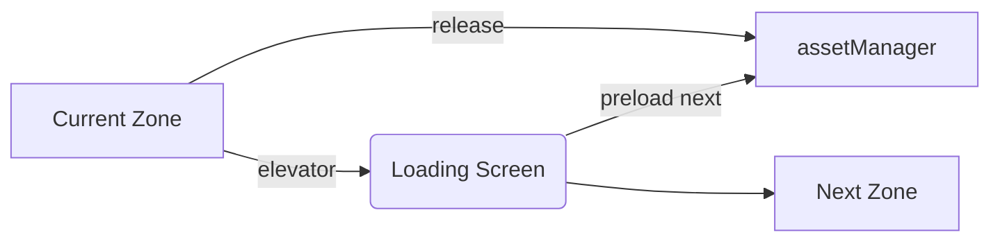

# AVGame – Technical Overview

## Core Tech Stack

- **TypeScript** – primary language
- **Vite** – build system & dev server with hot‑reload
- **Three.js** – 3‑D graphics engine
- **Vue 3** – UI/HUD framework (native Vite integration)

## Basic Directory Structure

```
./              # project root
├─ src/         # source code
├─ public/      # static assets referenced by Vite
└─ docs/        # technical & design docs
```

## Engine Architecture

### Core Systems

#### Renderer

- Three.js‑based 3‑D renderer
- Fixed 3 ⁄ 4 isometric camera with optional rotation
- Tron‑inspired visual style:
  - Edge glow & emissive outlines
  - Emission maps for energy/corruption layers
  - Custom shaders (corruption spread, energy pulses)
- Efficient tile rendering:
  - Geometry instancing for repeats
  - View‑frustum & occlusion culling
  - Merged geometry for static decor
  - Level‑of‑detail (LOD) on distant tiles

#### Input System

- **WASD** movement + mouse aim
- Re‑bindable hot‑keys for abilities
- UI input routing (menus, inventory)
- Game‑pad support (future)

#### State Management

```
MainMenu
  └─ GameSession
       ├─ Playing
       ├─ Paused
       ├─ Inventory
       └─ Map
  └─ LevelEditor
  └─ Settings
```

- State persistence & save/load

#### UI Framework

- Vue Single‑File Components (SFC)
- Pinia store for UI state
- Composable widgets:
  - HUD (health, energy, status)
  - Inventory / equipment
  - Skill‑tree
  - Buff/debuff tracker
  - Tooltips & context panels

### Game Systems

#### Grid System

- Tile‑based world graph
- A\* path‑finding
- Line‑of‑sight & fog
- Tile flags (walkable, corrupted, etc.)

#### Entity‑Component System (ECS)

Components:

- Transform (pos/rot/scale)
- Combat stats (Integrity, Firewall, Energy)
- AI behaviour tree
- Projectiles & hit‑boxes
- Status effects & timers
- Visual & audio emitters

#### Combat System

- Projectile pooling & travel
- Hit detection
- Damage & resist calculations
- Status effect handler
- Heat/energy & cooldown tracking

#### Particle System

- Trails, impacts, environmental FX
- Corruption spread overlays
- Energy pulse & UI particles

#### Audio System

- SFX registry & pooling
- Adaptive music layers
- Positional & doppler audio

### Data Management

#### Asset Loading (build‑time)

- Vite handles hashing, compression, code‑splitting
- Plugins: KTX2/Basis texture transcoding, vite‑imagetools, vite‑plugin‑glsl
- Build emits `asset‑manifest.json` mapping logical paths → hashed URLs

#### **Asset Manager** (runtime)

> Centralised service for *when* and *how* assets enter/leave memory.

**Responsibilities**

- Async fetch & decode of models, textures, audio ⟶ `Promise<Asset>`
- In‑memory cache with reference counts
- Progress events for loading screens
- Variant selection (hi/lo‑res) & platform fall‑back
- Graceful disposal (`texture.dispose()`, geometry cleanup)

**Implementation sketch**

```ts
class AssetManager {
  private cache = new Map<string, {promise: Promise<any>; ref: number}>();

  load<T>(key: string, url: string, loader: Loader<T>): Promise<T> {
    const cached = this.cache.get(key);
    if (cached) { cached.ref++; return cached.promise; }

    const promise = new Promise<T>((res, rej)=>
      loader.load(url, res, undefined, rej));

    this.cache.set(key, { promise, ref: 1 });
    return promise;
  }

  release(key: string) {
    const rec = this.cache.get(key);
    if (!rec) return;
    if (--rec.ref === 0) {
      // TODO: explicit GL resource disposal here
      this.cache.delete(key);
    }
  }
}
export const assetManager = new AssetManager();
```

**Boot sequence**

1. Fetch `asset‑manifest.json`.
2. Push required assets for first scene into `assetManager.load()`.
3. Display loading bar via progress events.
4. Transition GameState → *Playing* once all Promises resolve.

**Level streaming**



**Future extensions**

- Priority queues for streaming & LOD
- CDN base switching via `assetManager.setBase(url)`
- Hot‑reload path in Level Editor using `import.meta.glob`

#### Save System

- Character progression & load‑outs
- Level state snapshot
- Settings (video, key‑binds)

### Development Tools

#### Debug Overlay

- FPS gauge
- ECS/world inspectors
- Hit‑box & path visualisers
- Memory & VRAM statistics

#### Level Editor

- Tile & entity palette
- Property panel
- In‑editor play‑test mode
- Import/Export `.json` level spec

## Performance

### Rendering

- Instanced & batch rendering
- Occlusion culling
- Texture atlases
- Shader pre‑compilation & caching

### Memory

- Asset & entity pooling
- GC‑friendly object reuse
- Heap/V8 & WebGL memory tracking

### Networking (future‑proof)

- Client/server tick design draft
- Deterministic lock‑step vs. state sync evaluation

## Build & Deploy

- Vite prod config (`mode=production`, `base=/dist/`)
- Brotli/gzip compression
- Electron & Web export targets

## Testing

- Vitest unit tests
- Playwright end‑to‑end UI tests
- Automated performance regression suite

## Next Steps

1. Scaffold repo & Vite config ✅
2. Implement core rendering pipeline ➜ *WIP*
3. Stub AssetManager & bootstrap loader screen
4. Basic movement & input mapping
5. Establish UI widgets & HUD
6. Prototype ECS & combat loop

