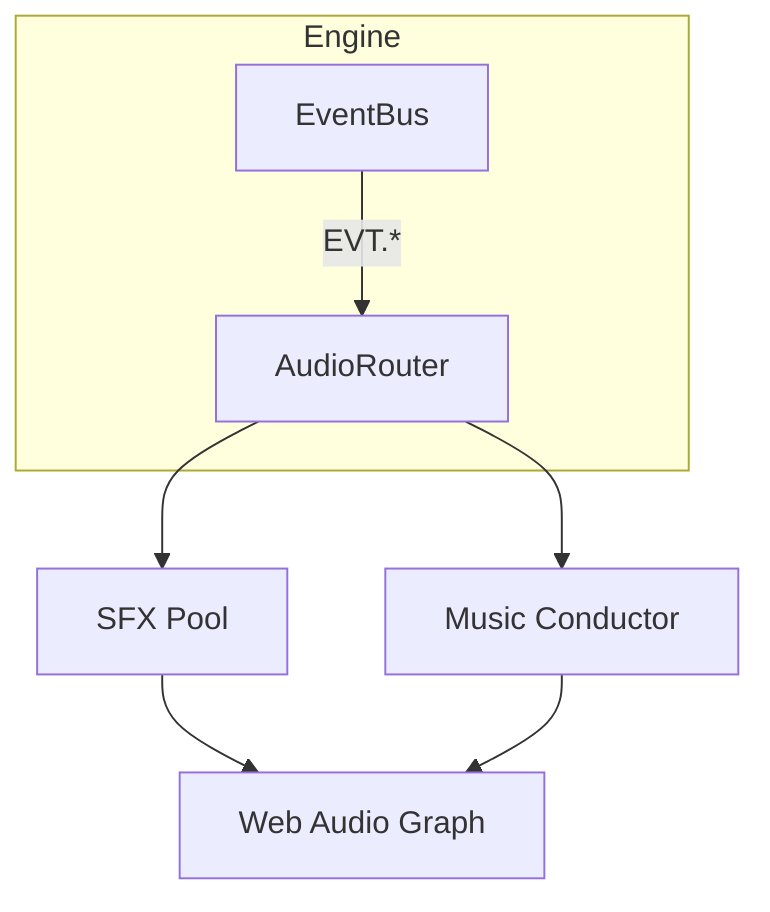
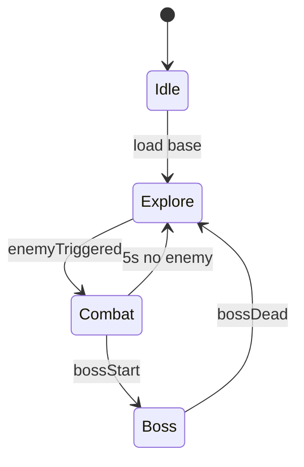

# Audio System Specification

> **Objective** — Provide low‑latency, high‑fidelity sound that reacts to gameplay: positional SFX, layered music that ramps with combat intensity, and a simple authoring workflow.

---

## 1 – Design Tenets
| Tenet | Why it matters |
|-------|---------------|
| **Event‑Driven** | Decouple gameplay logic from audio playback for maintainability. |
| **Layered Music** | Adaptive score heightens tension without hard scene switches. |
| **Positional Mixing** | Spatial cues improve situational awareness in an isometric view. |
| **Lightweight Runtime** | Pure Web Audio API—no external libs; keeps bundle slim and extensible. |
| **Memory‑Aware** | Stream large tracks; pool short SFX buffers. |

---

## 2 – Stack Overview


- `AudioRouter` subscribes to game events (`EVT.DAMAGE_DONE`, `EVT.PLAYER_DEAD`, etc.)
- `SFX Pool` handles one‑shot effects with positional panners.
- `Music Conductor` manages layered loops & transitions.
- All nodes converge on a **master Gain → DynamicsCompressor → destination**.

---

## 3 – Asset Types & Loading
| Type | Format | Loader |
|------|--------|--------|
| **SFX** | OGG (Vorbis) ≤ 3 s | Pre‑decoded `AudioBuffer`; loaded via AssetManager on scene start. |
| **Music Stems** | OGG loops, seamless | Streamed via `AudioBufferSource` + `fetch`/`arrayBuffer` at runtime; decode async. |
| **Voice/Bark** | OGG long form | On‑demand streaming; destroyed after playback. |

AssetManager exposes `loadAudio(url, { stream: bool })` returning `Promise<AudioBuffer|MediaElementAudioSourceNode>`.

---

## 4 – SFX Pool
```ts
class SFXPool {
  private cache: Map<string, AudioBuffer>;
  private voices: AudioBufferSourceNode[] = [];

  play(id: string, options: { pos?: Vec3; gain?: number; pitch?: number }) {
    const buf = this.cache.get(id);
    if (!buf) return;
    const src = ctx.createBufferSource();
    src.buffer = buf;
    src.playbackRate.value = options.pitch ?? 1;

    const gain = ctx.createGain();
    gain.gain.value = options.gain ?? 1;

    const panner = ctx.createPanner();
    if (options.pos) setPannerPos(panner, options.pos);

    src -> gain -> panner -> master;
    src.start();
    src.onended = () => src.disconnect();
  }
}
```
- **Max voices** per category (e.g., `ENV`, `UI`, `COMBAT`) to avoid clutter.
- **Pitch randomisation** (`±5 %`) for variety.

---

## 5 – Music Conductor
### 5.1 Layer Model
| Layer | Purpose | Volume Curve |
|-------|---------|--------------|
| **Base** | ambient bed | always −6 dB |
| **Tension** | ramps with enemy aggro count | 0→−3 dB |
| **Combat** | active while `inCombat` flag | −∞→0 dB fade 0.5 s |
| **Boss** | overrides others | full scale |

### 5.2 State Machine

`MusicFSM` monitors events + timers, cross‑fades `GainNode` per layer.

---

## 6 – Positional Audio
- Web Audio’s **HRTF panner**; distance roll‑off = `linear 1 → 25 m`.
- Listener follows player `Transform` Y = 1.7 m.
- **UI SFX** bypass panner to centre channel.

---

## 7 – Dynamic Effects
| Effect | Implementation |
|--------|---------------|
| **Low Health filter** | `BiquadFilter` LP at 1 kHz, wetness based on HP %. |
| **Corruption zone muffle** | Convolver reverb impulse, cross‑fade on entry/exit. |
| **Slow‑Mo** | `playbackRate` 0.5 on master mix while bullet‑time active. |

---

## 8 – Authoring Workflow
1. Place OGGs in `public/audio/{sfx|music}`.
2. Add entry to `audio_manifest.json`:
```jsonc
"boltImpact": { "path": "sfx/bolt_impact.ogg", "category": "COMBAT" }
```
3. Hot‑reload supported via Vite; Dev overlay lists playing voices.

---

## 9 – Debug & Telemetry
- **Audio HUD (Alt +A)**: voice count, dB meter per bus.
- **Log missing SFX** warnings to console.
- Export `window.audioCtx` for quick tinkering in dev.

---

## 10 – Performance Targets
| Metric | Target |
|--------|--------|
| Latency (SFX trigger → output) | ≤ 25 ms |
| Concurrent voices | 32@1080p desktop, 16 on low tier |
| CPU utilisation | < 3 % main‑thread |

---

## 11 – Future Enhancements
1. **Occlusion** — raycast walls to auto‑duck muffled SFX.
2. **Wwise/FMOD export** bridge for pro sound teams.
3. **Procedural whoosh generator** for projectiles.
4. **Spatialisation via WebGPU compute** once spec matures.

---

*Last updated | 2025‑04‑19*

