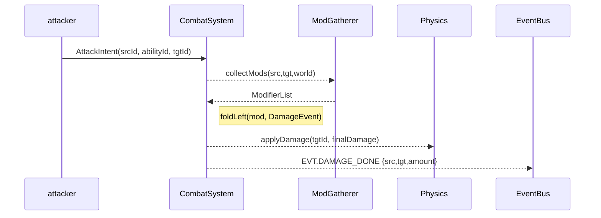

# Combat System Design

> **Objective** — Provide a deterministic, modifier‑driven combat pipeline where *anything* (gear, buffs, corruption level, difficulty settings) can tweak damage, status effects, or resource gains without spaghetti conditionals.

---

## 1 – Core Concepts
| Term | Meaning |
|------|---------|
| **DamageEvent** | Immutable struct describing an impending hit (source, target, baseDamage, type, critChance, etc.). |
| **Modifier** | Pure function `(DamageEvent) -> DamageEvent` applied in sequence. |
| **DamageType** | `KINETIC`, `ENERGY`, `CORRUPTION`, `TRUE`. Drives resist lookup. |
| **StatusEffect** | Time‑based component attached to entity (burn, slow, shield). |
| **Proc** | Chance‑based extra effect (e.g. *15 % to arc lightning on hit*). |

All numbers use **fixed‑point (Q16.16)** ints to avoid FP drift in deterministic multiplayer.

---

## 2 – Component Layout
| Component | Fields | Notes |
|-----------|--------|-------|
| **CombatStats** | `atk`, `crit`, `critDmg`, `speed` | Base numbers per entity |
| **Resistances** | `kinetic`, `energy`, `corruption` | 0–100 (%) capped |
| **ModifierSource** | `mods[]` (uint32 handles) | List of active modifier IDs |
| **Cooldowns** | `abilityId -> msRemaining` map | Ability gating |
| **Heat** | `current`, `max`, `regen` | Overheat resource |

*Modifiers live in a **global registry** (`ModTable`) so component stores only handles → tiny memory footprint.*

---

## 3 – Modifier System
### 3.1 Data Format
```jsonc
// +10 % Damage vs. Corrupted
{
  "id": 102,
  "name": "Purifier",
  "phase": "MULTIPLY",
  "when": "target.tags.includes('Corrupted')",
  "expr": "damage * 1.10"
}
```
- **phase** enumerates where in the pipeline the expr executes (`ADD`, `MULTIPLY`, `POST`, `ON_HIT`, etc.).
- **expr** is an `expr‑eval` JS snippet, pre‑parsed to AST at load.

### 3.2 Execution Order
1. **Base** lookup `CombatStats` + skill data.
2. **ADD** flat additions (`+15 dmg`, `+5 crit`).
3. **MULTIPLY** percentage modifiers (`×1.10`, `×0.85`).
4. **POST** clamp & final tweaks (crit roll, min‑dmg floor).
5. **ON_HIT** trigger procs, lifesteal, energy gain.

Within each phase mods sort by *priority* (default 0).

### 3.3 Runtime Flow


---

## 4 – Damage Formula
```
Base = Ability.baseDmg + CombatStats.atk
if critRoll < CritChance:
    Base *= CritDmg

// Resist mitigation (linear)
Mitigated = Base * (1 - Resist(type)/100)

// Fold modifiers
Final = applyModifiers(Mitigated)
```
All maths in `int` (`damage << 16`)

---

## 5 – System Implementation (bitecs)
```ts
function CombatSystem(world: IWorld) {
  const qAttack = defineQuery([AttackIntent]);

  for (const eid of qAttack(world)) {
    const src = AttackIntent.source[eid];
    const tgt = AttackIntent.target[eid];
    const ability = AbilityTable[AttackIntent.ability[eid]];

    let evt: DamageEvent = makeBaseEvent(src, tgt, ability);
    const mods = gatherMods(src, tgt, ability, world);
    for (const mod of mods) evt = mod.apply(evt);

    applyDamage(world, evt);
    spawnHitFX(evt);
  }
  return world;
}
```

---

## 6 – Status Effects
- Implemented as **component + timer array** (in `StatusEffect` component).
- `StatusSystem` steps timers each frame, applies recurring damage or stat changes.
- Mods can grant **immunity** by filtering `StatusApply` events.

---

## 7 – Ability Cooldowns & Heat
| Mechanic | Details |
|----------|---------|
| **Cooldowns** | Stored per ability; decremented in `CooldownSystem` each tick. |
| **Heat** | Abilities add heat; passive regen drains; overheat disables energy abilities until cooled. |

---

## 8 – Event Types
```ts
enum EVT {
  DAMAGE_DONE,
  HEAL_DONE,
  STATUS_APPLY,
  CRIT,
  PROC_TRIGGER
}
```
Systems (UI, Audio, Networking) subscribe without tight coupling.

---

## 9 – Testing Strategy
1. **Math snapshot tests**: JSON fixtures run through pipeline → expect result.
2. **Property‑based**: random stats/mod sets; assert damage in safe range.
3. **Determinism**: feed same seed + event log; expect byte‑identical outputs.

---

## 10 – Roadmap
1. **Buff stacking rules** (additive vs. multiplicative categories).
2. **DOT pooling** — group identical DOT instances for perf.
3. **Area damage batching** — spatial hash queries to hit multiple enemies.
4. **Network rollback hooks** for client‑side hit prediction.

---

*Last updated | 2025‑04‑19*

