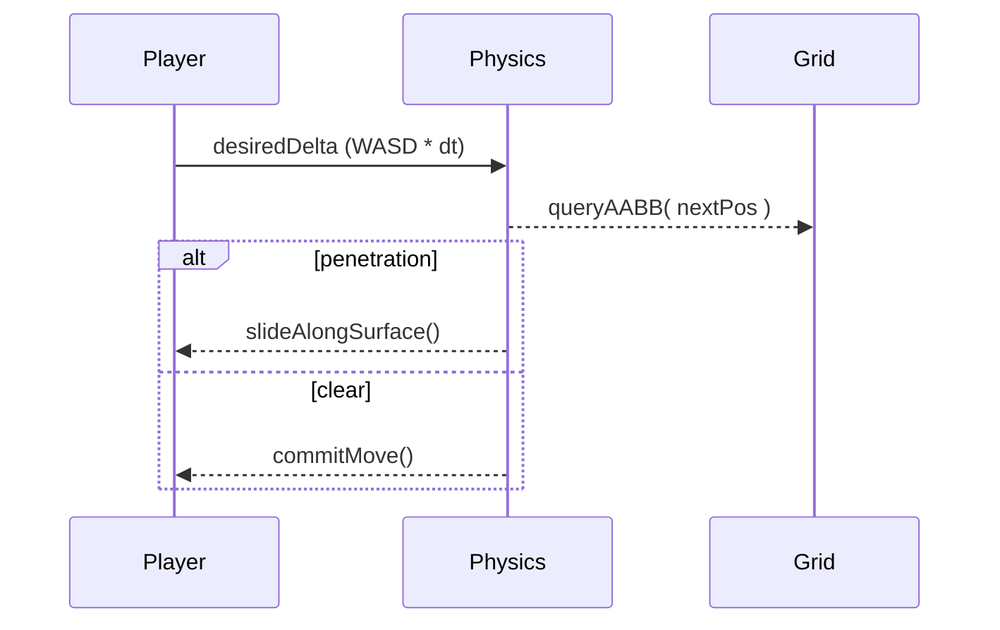

# Grid System & Level Composition

> **Mission** — Represent the world as a **logical grid** for AI/path‑finding while keeping **player motion fully analogue** and enabling procedurally stitched levels.

---

## 1 – Design Objectives
| Objective | Notes |
|-----------|-------|
| **Logical clarity** | Tile graph is easy to reason about for AI, LOS, corruption spread. |
| **Continuous movement** | Player & projectiles interpolate freely; no grid‑snap. |
| **Minimal colliders** | Merge tiles into convex hulls/R‑trees to keep physics cheap. |
| **Composable rooms** | Levels built from reusable JSON "room prefabs" (hand‑made or RNG). |
| **Stream‑ready** | Load/unload room chunks at runtime for big maps. |

---

## 2 – Coordinate Spaces
| Space | Unit | Purpose |
|-------|------|---------|
| **Tile Space** | `1 tile = 1 m` | Integer grid (x,z) for path‑finding & fog. |
| **World Space** | metres | Float positions; entities move & collide here. |
| **NavMesh Space** | same as World | Convex polys generated from merged tile areas. |

Conversion: `worldPos.x = tileX + 0.5`, `worldPos.z = tileZ + 0.5` centre‑of‑tile convention.

---

## 3 – Tile Meta‑Model
```ts
interface Tile {
  id: number;              // unique per level
  flags: TileFlags;        // Walkable | BlockVision | DamageOnStep | etc.
  height: 0 | 0.5 | 1;     // allows ramps, pits
  variant: string;         // visual (floor type)
  regionId?: number;       // for room membership
}
```
`TileFlags` is a bit‑mask; query with `(tile.flags & TileFlags.Walkable) !== 0`.

### Tile Layers
1. **Base** floor, pits, lava
2. **Walls** blocking geometry (can be separate grid for 2‑D simplicity)
3. **Overlays** corruption footprints, decals (do not affect nav)

---

## 4 – Collision Strategy
### 4.1 Static Colliders
1. **Scanline merge** adjacent solid tiles into **rectangles** (axis‑aligned bounding boxes) at level import.
2. Convert rectangles to **three‑mesh** `BoxBufferGeometry` or physics engine shapes.
3. Store AABB list in **R‑Tree** for broad‑phase queries.

Outcome: 3000 solid tiles → < 200 collider boxes.

### 4.2 Dynamic Entities
- Capsule collider for player; swept‑capsule vs. AABB test.
- Enemy/prop colliders registered in same R‑Tree at spawn, removed on death.

### 4.3 Continuous Movement


---

## 5 – Path‑Finding & LOS
| System | Details |
|--------|---------|
| **A\*** | 4‑ or 8‑way neighbours; heuristic = Manhattan × costMultiplier |
| **Cost Layers** | Dynamic weight map (slows on corruption, hazards) |
| **LOS** | Bresenham grid‑ray; early‑out on `BlockVision` |
| **NavMesh (future)** | Build from merged walkable rects for smoother enemy steering |

`Pathfinder.find(start, goal, costMap)` returns array of tile coords; AI converts to way‑points then lerps in World Space.

---

## 6 – Room Prefabs & Level Assembly
### 6.1 Room JSON Schema
```jsonc
{
  "id": "corridor_L",
  "size": [8, 4],          // tiles (width, height)
  "doorways": [            // local tile coords where doors may spawn
    { "pos": [0,1], "dir": "W" },
    { "pos": [7,2], "dir": "E" }
  ],
  "tiles": [ /* 2‑D array of TileFlags */ ]
}
```

### 6.2 Level Graph Generator
1. Select start room.
2. Loop until `targetTiles` filled:
   - Pick open doorway.
   - Choose compatible room prefab (random weighted)
   - Transform/rotate prefab → world coords.
   - Check collision with existing rooms; retry on clash.
3. Seal unused doorways with wall prefab.

### 6.3 Chunk Streaming
- Rooms are grouped into **chunks** (32×32 tiles).
- AssetManager preloads next chunk when player is ≤ 10 tiles from boundary.
- Static colliders & meshes of far chunks disposed.

---

## 7 – Data Flow
```mermaid
graph LR
  subgraph Load‑time
    A[Room JSON] --> B(RoomAssembler)
    B --> C[TileMap]
    C --> D[ColliderBuilder]
    C --> E[VisualTileMeshes]
  end
  D -->|AABB list| Physics
  TileMap -->|graph| Pathfinder
```

---

## 8 – APIs
```ts
class GridSystem {
  readonly width: number;
  readonly height: number;
  tiles: Uint32Array; // packed TileFlags

  isWalkable(x: number, z: number): boolean;
  raycastLOS(a: Vec2, b: Vec2): boolean;
  costAt(x: number, z: number): number;
}

const grid = GridSystem.fromRooms(roomList);
physics.setWorld(grid.colliders);
```

---

## 9 – Performance Targets
| Task | Target | Notes |
|------|--------|-------|
| A* path 128×128 | < 0.5 ms (single search) | priority queue on heap |
| Collider merge on load | < 30 ms / chunk | offline preprocessing possible |
| LOS ray | ≤ 50 µs | bit‑grid lookup |

---

## 10 – Future Enhancements
1. **Weighted NavMesh** for diagonal smoothing.
2. **Dynamic tile updates** (destroy walls, build bridges) — triggers partial collider rebuild.
3. **Seeded procedural generator** for deterministic multiplayer maps.
4. **Portal occlusion** — room‑to‑room visibility culling linked to doorways.

---

*Last updated | 2025‑04‑19*
