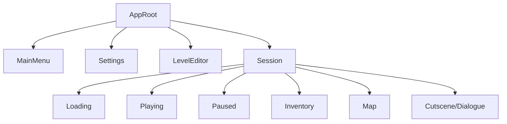

# State Management Specification

> **Scope** Defines how AVGame tracks, transitions, and persists *everything* that can happen—from menus to live combat—while staying extensible for future multiplayer and mod hooks.

---

## 1 – Principles & Goals
| Principle | Why |
|-----------|-----|
| **Single Source of Truth** | Avoid divergent UI/game logic by storing canonical state in one place. |
| **Hierarchical FSM** | Scales cleanly: new sub‑screens or mini‑games slot in without spaghetti transitions. |
| **Event‑Driven** | Loose coupling; systems listen to intent events rather than poking state directly. |
| **Hot‑Reload Friendly** | Enable dev reloads without tearing down WebGL context or losing session data. |
| **Serializable** | Easy save/load, rollback debugging, and deterministic replays. |
| **Side‑Effect Isolation** | State updates are pure; side‑effects live in middleware for testability.

---

## 2 – State Tree Overview

- **AppRoot** top‑level FSM runs *exactly one* child at a time.
- **Session** is itself a composite FSM that persists while player is in‑game.

### Orthogonal Regions (future)
- *Multiplayer* connection state (Connected / Reconnecting / Disconnected).
- *Debug overlay* (Shown / Hidden) can toggle without affecting gameplay.

---

## 3 – Implementation Choices
### 3.1 Library vs. Custom
| Option | Pros | Cons |
|--------|------|------|
| **XState** | battle‑tested, visualization tools, hierarchical & parallel states built‑in | bundle size ≈ 16 KB, learning curve |
| **Tiny Finite‑State lib** (e.g. `@casual-simulation/aux-common/StateMachine`) | light (≤ 2 KB) | lacks dev‑tools, parallel states |
| **Custom** (≈ 150 LoC) | tailored API, zero deps | reinvents wheel, fewer tooling |

**Decision:** start with **XState**; guarded transitions, delayed events, and dev‑tools outweigh small size hit. Swap later if WebGPU build size becomes critical.

### 3.2 Project Layout
```
src/
  state/
    machines/
      app.machine.ts        # AppRoot FSM
      session.machine.ts    # in‑game composite FSM
      editor.machine.ts
      multiplayer.machine.ts (stub)
    events.ts               # typed event definitions
    selectors.ts            # derive computed values (memoised)
    middleware/
      persistence.ts        # save/load side‑effects
      audio.ts              # play SFX on state change
```

---

## 4 – TypeScript Contracts
```ts
// events.ts
export type AppEvent =
  | { type: 'START_NEW_GAME'; seed: number }
  | { type: 'CONTINUE' }
  | { type: 'OPEN_SETTINGS' }
  | { type: 'EXIT_TO_MENU' };

export type SessionEvent =
  | { type: 'PAUSE' }
  | { type: 'RESUME' }
  | { type: 'OPEN_INVENTORY' }
  | { type: 'CLOSE_INVENTORY' }
  | { type: 'PLAYER_DEAD' };
```

```ts
// app.machine.ts (excerpt)
import { createMachine, assign } from 'xstate';
import { loadSave } from '../middleware/persistence';

export const appMachine = createMachine<AppContext, AppEvent>({
  id: 'app',
  initial: 'mainMenu',
  states: {
    mainMenu: {
      on: {
        START_NEW_GAME: 'session.loading',
        CONTINUE: { target: 'session.loading', actions: 'hydrateSave' },
        OPEN_SETTINGS: 'settings'
      }
    },
    settings: { /* … */ },
    session: {
      type: 'parallel',
      states: {
        flow: sessionMachine,  // imported composite FSM
        multiplayer: multiplayerMachine // orthogonal region
      }
    }
  }
}, {
  actions: {
    hydrateSave: assign({ saveData: (_, e) => loadSave() })
  }
});
```

---

## 5 – Persistence Strategy
| Layer | Data | Format |
|-------|------|--------|
| **Player Save** | inventory, stats, quest flags | Zstd‑compressed JSON (≈ 5–25 KB) |
| **World Snapshot** | tile corruption, loot drops | IndexedDB chunked, snapshot‑per‑level |
| **Settings** | video, key‑binds | localStorage (simple key/value)

Persistence middleware listens to specific events (`PLAYER_DEAD`, `MANUAL_SAVE`) and serializes the relevant slices. On *continue*, middleware dispatches `HYDRATE_SAVE` into the FSM before it enters `Playing`.

---

## 6 – Extension Points
- **Modal Stacks** Use a *stack* in `session.overlay` state to push temporary screens (map → codex → item tooltip) without flattening the FSM.
- **Timed States** `after 3000` transitions for fade‑outs, boss intros.
- **Plug‑in Guards** `canAccessLevel(levelID)` guard imported from progression service.
- **Developer Commands** Expose `window.sm.send('PAUSE')` for quick debugging.

---

## 7 – Testing & Debugging
- **xstate‑inspect** in dev builds (web‑based visualizer).
- **Jest/Vitest** unit tests use `createTestMachine` to step through events and assert context mutations.
- Snapshot tests ensure save/load round‑trips are deterministic.

---

## 8 – Performance Considerations
- FSM transition cost ≪ 1 µs/event; negligible versus render frame.
- Context updates batched; Pinia/UI subscribe via `selector` + `debounce(0)` to avoid over‑rendering.

---

## 9 – Roadmap
1. Finish persistence middleware (IndexedDB adapter).
2. Add **replay recorder** (log events; feed them back for determinism testing).
3. Support **dynamic DLC states** loaded via async import.
4. Evaluate **multiplayer sync**—drive authoritative server FSM or state diff.

---

*Last updated | 2025‑04‑19*

