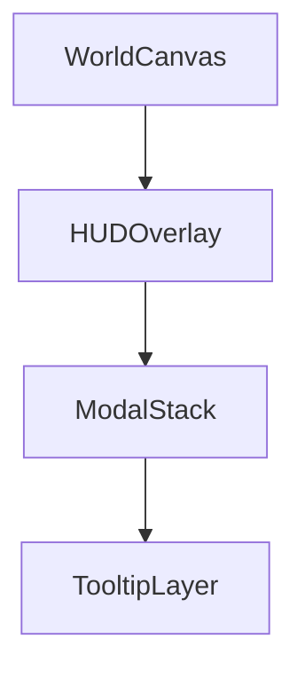

# UI System Specification

> **Objective** — Deliver a responsive, themeable, and extensible user interface powered by Vue 3 & Pinia that cleanly overlays the 3‑D world, feeds from game state without duplication, and can be iterated on rapidly by designers.

---

## 1 – Design Principles
| Principle | Reason |
|-----------|--------|
| **Separation of Layers** | Keep DOM/CSS UI concerns out of core game logic for maintainability. |
| **State Singletons** | UI reads from the same Pinia stores the gameplay FSM updates—no shadow copies. |
| **Composable Components** | Small, self‑contained Vue SFCs encourage reuse & quick iteration. |
| **Accessibility First** | Keyboard nav, ARIA roles, color‑blind palettes baked‑in. |
| **Theme Tokens** | Global CSS variables enable dark/light & Tron‑noir brand colors without mass refactor. |
| **Hot‑Reload** | Vite HMR enables live tweaking of HUD in a running scene. |

---

## 2 – Layer Architecture

| Layer | Tech | Z‑index | Notes |
|-------|------|---------|-------|
| **WorldCanvas** | WebGL `<canvas>` | 0 | Renderer output |
| **HUDOverlay** | `<div id="hud">` | 10 | Health, energy, cross‑hair |
| **ModalStack** | `<div id="modals">` | 20 | Pause, inventory, map |
| **TooltipLayer** | `<div id="tooltips">` | 30 | Follows mouse; pointer‑events none |

All DOM layers live in `#ui-root` absolutely full‑screen; CSS Grid positions major HUD islands.

---

## 3 – Technology Stack
| Concern | Lib / Approach |
|---------|---------------|
| **Framework** | Vue 3 Composition API |
| **State** | Pinia (`useGameStore`, `useUIStore`) |
| **Styling** | Native CSS variables + SASS modules; optional Tailwind classes where ergonomic (utility clusters) |
| **Icons** | Lucide via `v-lucide` component |
| **Animations** | Framer Motion Vue wrapper (`vue3-motion`) for enter/leave |
| **Forms** | Headless UI Vue for menus & dropdowns |
| **i18n** | `vue-i18n` lazy‑loaded locale packs |

---

## 4 – Pinia Store Schema (excerpt)
```ts
export const useGameStore = defineStore('game', {
  state: () => ({
    hp: 100,
    hpMax: 100,
    energy: 50,
    energyMax: 50,
    heat: 0,
    inCombat: false,
    status: [] as StatusID[]
  }),
  getters: {
    hpPct: s => s.hp / s.hpMax,
    energyPct: s => s.energy / s.energyMax
  }
});

export const useUIStore = defineStore('ui', {
  state: () => ({
    modalStack: [] as ModalID[],
    tooltip: null as TooltipPayload | null,
    hudVisible: true
  })
});
```

Game ECS → EventBus posts `EVT.STATS_UPDATE`; a Vue plugin subscribes and commits to `useGameStore`—no polling.

---

## 5 – Component Catalog
| Component | Slots / Props | Purpose |
|-----------|---------------|---------|
| `<HealthBar>` | `:value`, `:max` | Animated HP bar, color shifts at <25 % |
| `<EnergyMeter>` | same | Displays energy + overheat overlay |
| `<StatusIcon>` | `:effect` | Shows tooltip on hover |
| `<Crosshair>` | variant prop | Simple `<svg>` reticle; pulsates on crit |
| `<FloatingNumber>` | `:amount`, `:crit` | Spawns in world; uses Vue Teleport to HUD layer |
| `<PauseMenu>` | emits `resume`, `settings` | vertical nav list, keyboard & pad support |
| `<InventoryGrid>` | `:items[]` | Draggable items, grid auto‑layout |
| `<MapView>` | reads GridSystem chunks | WebGL mini‑map inside Vue canvas |

---

## 6 – Modal Stack Mechanism
- `pushModal(id)` / `popModal()` mutations on `uiStore.modalStack`.
- `<ModalContainer>` renders top‑of‑stack with `<transition>` fade.
- Escape key pops; stack clears on state change (`Session.Playing` → others).

---

## 7 – Styling & Theme Tokens
```css
:root {
  --color-bg: #0b0c10;
  --color-fg: #e6e6e6;
  --color-accent: #29f8ff;
  --color-hp: #ff3264;
  --color-energy: #29f8ff;
  --radius: 8px;
}
.dark {
  --color-bg: #050607;
}
```
- Switch theme by toggling `.dark` class on `<body>`.
- All SFC style blocks reference variables; no magic hex codes.

---

## 8 – Accessibility & Input
| Feature | Implementation |
|---------|---------------|
| Keyboard nav | `v-focus-ring` directive handles Arrow / Enter focus loops |
| Screen reader | Each component exports `aria-label`; icons get `aria-hidden="true"` |
| Color‑blind | Alt palette via CSS variable patch (`theme-colorblind.css`) |
| Scalable UI | `rem` base size bound to user “UI scale” slider (0.8–1.5) |

---

## 9 – Localization
- `locales/en.json`, `locales/ru.json` etc.; keys = dotted paths.
- `t('hud.health')` inside components.
- Lazy load locale pack on first use; fallback to English.

---

## 10 – Testing & CI
| Level | Tool | Notes |
|-------|------|-------|
| Unit | Vitest + Vue Testing Library | snapshot component output |
| Visual | Storybook + Chromatic | CI diff on PR |
| E2E | Playwright | open inventory, drop item, ensure state |

---

## 11 – Performance Targets
| Metric | Target |
|--------|--------|
| HUD render cost | < 0.4 ms/frame |
| Modal open time | < 150 ms including fade |
| Memory | < 5 MB DOM nodes |

---

## 12 – Future Enhancements
1. **HUD editor** — drag HUD widgets live, export layout JSON.
2. **Theming API** — user skins via CSS var patch packs.
3. **VoiceOver captions** — speech bubble overlay driven by AudioSystem events.
4. **WebXR HUD** for potential VR spin‑off.

---

*Last updated | 2025‑04‑19*

